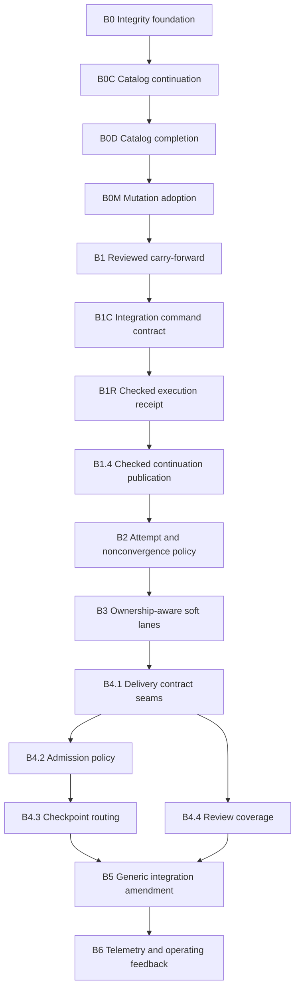

> **Superseded (2026-07-25).** This program completed through B6 (PRs #79–#99). Its
> inventory counts have rotted against reality (it says 109/108 catalog rows; the
> catalog is 196/195) and its B5 legacy allowance is withdrawn. The governing
> post-completion authority is `ISSUE-69-PROGRAM-REVIEW.md` (policies P1/P2/P3 and
> the Part 6 execution sequence). Retained verbatim as the historical program record.

# Issue #69 Implementation Program

Status: proposed implementation decomposition derived from
`ISSUE-69-FIVE-WHYS.md`. This is intentionally a program of small briefs, not one
factory feature. The work-decomposer rejected the combined action set because the
required authority changes cannot fit safely within the four-wave depth limit.

## Baseline gate

Initial B0 implementation started from refreshed `main` containing merged PR #79 at
`f4e4b8bb1cee614322d8a14c1b75d0bd26122557`. PR #81 then merged the reviewed B0
catalog as `1be29edc909bd803598504e8b281ee3234c3fbc3`. B0M and every later brief must
start from that exact PR #81 merge or a descendant of it; issue #82 is the tracked
production-adoption contract. The current root checkout remains the dirty
`feature/slice-convergence-attempt-budget` branch at
`5f85f1f2935521eb4545ffe510265dae999bb16c` and is not an implementation base.

Before starting B0:

1. verify the fetched `origin/main` merge ancestry;
2. create a clean program worktree from the exact `origin/main` commit;
3. record that SHA in the first brief and every child slice claim;
4. consume the WIP only through the disposition below, never by merging its branch
   or dirty tree wholesale.

### Attempt-WIP evidence snapshot

The dirty attempt-budget state was captured at `2026-07-16T13:28:45Z` as immutable
Git blobs without changing the worktree:

| Snapshot | Git blob |
| --- | --- |
| NUL-delimited `git status --porcelain=v1` | `280c5a2bd568c3bd89cdee4fe5282169b1e87628` |
| Binary tracked diff from `5f85f1f` | `8397bfbd6f8648c2d6211439144223ed7b290531` |
| Untracked `test/slice-attempt-budget.test.js` | `75db61dffa94b13b8416e31d03a16fc6d4a659d3` |
| Untracked Claude analysis | `16df3d5b57499a7b9f91e5fb0a8054f5139ebacf` |
| Untracked combined Five Whys | `a8d846a9fb49f1d03ea153806a61221016cac95e` |
| Pre-review implementation DAG | `1a9c21ffb9858bdb0b99f4de7e16844a7ae17b66` |

Path-by-path disposition:

| Paths | Disposition |
| --- | --- |
| `src/cli.js`, `src/run-state.js`, `src/validate.js`, `test/cli-write-surface.test.js`, `test/run-state.test.js`, `test/validate.test.js`, `test/slice-attempt-budget.test.js` | Reimplement only one-step progression, byte-bound reviews, append-only history, and atomic counts in B2. Supersede all attempt-4 eligibility behavior. |
| `assets/agent/work-decomposer.md`, `assets/agent/work-reviewer.md`, `assets/skills/feature/SKILL.md`, `assets/skills/feature/SCHEMA.md`, `test/docs-contract.test.js` | Reimplement the fixed-three-attempt and convergence contracts in B2. Supersede `max_attempts: 4` and `dominant_concern` policy text. |
| `DOGFOOD-LEARNINGS.md`, `README.md`, `assets/agent/backend-builder.md`, `assets/agent/frontend-builder.md`, `assets/command/feature.md` | Unrelated/adjacent lineage and lane edits. Preserve in the current worktree; do not consume as B2 implementation. Re-evaluate independently in the later owning brief. |
| `ISSUE-69-FIVE-WHYS-CLAUDE.md`, `ISSUE-69-FIVE-WHYS.md`, `ISSUE-69-IMPLEMENTATION-DAG.md` | Analysis artifacts, preserved outside the attempt-policy implementation. |

## Program DAG

The program is deliberately serial at authority boundaries. B4.1 pre-wires two
file-disjoint extension lanes so B4.2 and B4.4 may run in parallel; B5 joins both.
The critical safety path is `B1 -> B1C -> B1R -> B1.4 -> B2 -> B3 -> B4 -> B5`. In particular, terminal
nonconvergence cannot activate before B1 provides reviewed carry-forward, and soft
lanes cannot activate before B3 has durable effective ownership and post-PR
attribution.

## Shared-file serialization

The following files are authority hotspots. Only one brief may own each at a time,
even when other work is logically independent:

| Hotspot | Serial brief order |
| --- | --- |
| `src/factory.js` | B0M.1/B0M.2/B0M.4, then B0MR.2, then B1.2/B1.3, then B1.4, then B2.3, then B3.3/B3.4, then B4.3, then B5, then B6 |
| `src/run-state.js` | B0M, then B0MR.1/B0MR.2, then B1.2, then B1C, then B1R, then B1.4, then B2, then B3, then B4.1, then B5 |
| `src/validate.js` | B0M, then B0MR.1/B0MR.2, then B1.2, then B1C, then B1R, then B1.4, then B2, then B3, then B4.1, then B5 |
| `src/cli.js` | B0M.3, then B0MR.2, then B1R, then B1.4, then B2.1, then B5.2 |
| `assets/skills/feature/SKILL.md` | B0.1, then B0MR, then B1.4, then B2, then B3.4, then B4, then B5 |
| `assets/skills/feature/SCHEMA.md` | B0.1, then B0M.1, then B0MR, then B1.1/B1.2, then B1C, then B1R, then B1.4, then B2, then B3, then B4.1, then B5 |
| `test/docs-contract.test.js` | B1C, then B1R, then B1.4, then B4.1, then B5; parallel B4 lanes use dedicated tests |
| durable mutation catalog files | B1C, then B1R, then B4.1; no parallel B4 lane may edit them |
| shared factory/run-state/validate/CLI tests | same order as their owning production files |

Agents may research later briefs in parallel, but implementation branches touching a
hotspot merge only in the order above. Every downstream branch rebases from the
actual merged predecessor rather than copying its unreviewed worktree.

## Slice execution index

Every slice has `max_attempts: 3`. The `Owned files` row in each detailed contract is
its exact path authority; later serial slices may own the same path only after the
earlier dependency is merged. No same-wave path overlap is permitted.
Every brief contains at most four sequential slices.

| Slice | `depends_on` | Dominant concern |
| --- | --- | --- |
| B0.1 | none | threat boundary contract |
| B0.2 | B0.1 | canonical semantic fixtures |
| B0.3 | B0.2 | finite mutation catalog and authority inventory |
| B0.4 | B0.3 | boundary-retention decision ledger |
| B0C.1 | B0.4 plus B0 integration review | independent descriptor-disposition oracle |
| B0C.2 | B0C.1 | canonical core run-state records |
| B0C.3 | B0C.2 | canonical post-PR records and sidecars |
| B0C.4 | B0C.3 | canonical PR #79 records and sidecars |
| B0D.1 | B0C.4 plus B0C security review | complete canonical-source and remediation-evidence coverage |
| B0M.1 | B0D.1 | plan and run-envelope mutation coverage |
| B0M.2 | B0M.1 | gate, step, continuation, and handoff mutation coverage |
| B0M.3 | B0M.2 | slice, review, verdict, and PR mutation coverage |
| B0M.4 | B0M.3 | post-PR and merged-repair mutation coverage |
| B0MR.1 | B0M.4 plus final B0M security reviews | reviewed-code byte/head and merge authority |
| B0MR.2 | B0MR.1 | PR operation observation, reconciliation, and post-PR handoff |
| B1.1 | B0MR.2 plus B0M integration verification | carry-forward authority contract |
| B1.2 | B1.1 | carry-forward manifest construction |
| B1.3 | B1.2 | atomic integration ancestry creation |
| B1C | B1.3 plus B1.3 integration review | machine-readable integration command authority |
| B1R | B1C plus B1C integration review | checked execution claim and receipt |
| B1.4 | B1R plus B1R integration review | accepted-slice re-adoption and checked activation |
| B2.1 | B1.4 | uniform attempt evidence and WIP supersession |
| B2.2 | B2.1 | terminal nonconvergence routing |
| B2.3 | B2.2 | semantic-fix classification and task reset |
| B3.1 | B2.3 | existing-round lane feasibility |
| B3.2 | B3.1 | durable effective ownership |
| B3.3 | B3.2 | unified ownership consumption |
| B3.4 | B3.3 | soft-lane runtime activation |
| B4.1 | B3.4 | shared delivery-contract schema and extension seams |
| B4.2 | B4.1 | bounded delivery admission |
| B4.4 | B4.1 | invariant-family review coverage |
| B4.3 | B4.2 | independently shippable checkpoint routing |
| B5.1 | B4.3 and B4.4 plus B4 integration review | generic amendment authority design |
| B5.2 | B5.1 | checked amendment state machine |
| B5.3 | B5.2 | delegated amendment execution |
| B5.4 | B5.3 | PR #79 parity migration |
| B6.1 | B5.4 | supported telemetry correlation contract |
| B6.2 | B6.1 | correlated factory span emission |
| B6.3 | B6.2 | saved operational analysis |

## B0 - Integrity substrate

Goal: make the threat model and durable-record mutation coverage executable before
adding more state-machine authority.

### B0.1 Threat contract

| Field | Contract |
| --- | --- |
| Intent | State exactly what the factory protects and remove claims of resistance to an arbitrary local filesystem/verifier attacker. |
| Owned files | `SPEC.md`; `assets/skills/feature/SKILL.md`; `assets/skills/feature/SCHEMA.md`; `README.md`; `test/docs-contract.test.js` |
| Acceptance | Documents consistently trust the local operator/host, distrust model claims and stale/crash-raced evidence, retain exact Git/test/review/merge bindings, and describe internal records as consistency/provenance controls. |
| Focused tests | `node --test test/docs-contract.test.js` |
| Exclusions | No validator simplification and no state-schema changes. |
| Risk | Low |

### B0.2 Canonical closed-schema fixtures

| Field | Contract |
| --- | --- |
| Intent | Centralize semantic fixture construction so later additive fields do not force cross-lane edits. |
| Owned files | new `test/helpers/run-record-fixture.js`; new `test/helpers/review-record-fixture.js`; fixture-only edits in `test/validate.test.js`, `test/run-state.test.js`, `test/factory-continue.test.js`, and, from the PR #79 baseline, `test/merged-slice-repair.test.js` |
| Acceptance | Semantic tests use shared builders; exact legacy-byte tests remain explicit local literals; helper defaults produce currently valid records. |
| Focused tests | the four migrated test files |
| Exclusions | No production behavior and no bulk rewrite of unrelated fixtures. |
| Risk | Medium because fixture changes can hide invalid defaults; exact legacy fixtures must remain separate. |

### B0.3 Durable mutation catalog and finite inventory

| Field | Contract |
| --- | --- |
| Intent | Generate missing/unknown-key, wrong kind/schema/time, wrong ref/hash/bytes, key-shape drift, and stale/cross-bound identity mutations from one finite authority catalog. |
| Owned files | new `test/helpers/durable-record-mutations.js`; new `test/durable-record-mutations.test.js`; `assets/agent/spec-writer.md`; `assets/skills/feature/SCHEMA.md`; `test/docs-contract.test.js` |
| Acceptance | The helper emits deterministic named cases, never mutates its source fixture, and supports exclusions only with a named reason. The catalog covers exactly the authority classes below. New durable authority records cannot claim integrity coverage until registered. A `final.plan.json` descriptor proves that mutating required `kind` is generated; `src/single-slice/schema-model/` is explicitly not created because it exists on neither verified baseline and belongs to the future record implementation, not this substrate. |
| Focused tests | `node --test test/durable-record-mutations.test.js test/docs-contract.test.js` |
| Exclusions | No production validator fixes in this slice. |
| Risk | Medium |

Finite authority inventory:

| Class | Existing authority seams |
| --- | --- |
| `plan/slices.json` graph and planned slices | `validateSlicesPlan`; `transitionRunSlicesSeed` |
| `run.json` envelope and `terminal_result` | `validateRun`; `validateTerminalResult`; `transitionTerminalResult` |
| gates, `pending_snapshot`, and `handoff_receipt` | `validateGate`; `transitionGateDecision`; `inspectApprovalHandoffReceipt` |
| steps, `acceptance`, and `inherited_acceptance` | `validateSteps`; `transitionRunStep`; `bindStepAcceptance` |
| slices, `review_binding`, `attempt_reviews`, evidence/review bytes | `validateRunSlice`; `transitionRunSlice`; `transitionSliceMerged` |
| validator/security verdicts and PR-created result | `validateVerdict`; `assertPassingVerdictArtifacts`; `transitionPrCreated` |
| `run.continuation` and planning/draft reuse | continuation validators; `buildContinuation`; `adoptContinuation` |
| `post_pr` policy, observation, remediation, revalidation, push, terminal fact, and continuation review | `validatePostPr`; checked post-PR transitions |
| PR #79 `run.merged_slice_repair` | PR #79 repair validator, transition, resume fence, and adversarial suite |

Diagnostic `debug_snapshot`, `provenance`, and `cost_attribution` records and liveness
files such as `heartbeat.json`, locks, and `process.json` are explicitly outside this
authority matrix; they retain their existing dedicated validation.

### B0.4 Boundary-retention decision ledger

| Field | Contract |
| --- | --- |
| Intent | Decide for every cataloged binding whether it is retained at a real authority boundary, safely re-observed, or removed as duplicate internal attestation. |
| Owned files | `SPEC.md`; `assets/skills/feature/SCHEMA.md`; new `DURABLE-AUTHORITY-LEDGER.md`; `test/docs-contract.test.js` |
| Acceptance | The ledger preserves exact Git/test/review/merge and external-effect identities; permits re-observation only from Git or checked external operations; names the canonical manifest that replaces any removed duplicate; includes the PR #79 fields expanded in B5.1. |
| Focused tests | `node --test test/docs-contract.test.js` |
| Exclusions | No production simplification; each behavior brief owns its own migration. |
| Risk | Medium |

## B0C - Catalog continuation

Goal: close the one independently reviewed catalog-oracle defect that remained after
B0.3 exhausted its three-attempt budget. This continuation starts from the exact B0
integrated HEAD in a fresh builder context; it is not a fourth B0.3 attempt.

### B0C.1 Independent descriptor-disposition oracle

| Field | Contract |
| --- | --- |
| Intent | Bind every record's exact mutation-family disposition and target definition in an oracle authored independently from the catalog under test. |
| Owned files | `test/helpers/durable-record-mutations.js`; `test/durable-record-mutations.test.js`; `assets/agent/spec-writer.md`; `assets/skills/feature/SCHEMA.md`; `test/docs-contract.test.js` |
| Acceptance | For all twelve mutation families, completeness rejects target deletion, target-to-exclusion or exclusion-to-target substitution, and mutation of any applicable target `path`, `value`, `from`, `to`, `key`, `sidecar`, or `label`; oracle expectations are not derived from the catalog; post-PR/PR79 coverage from B0.3 remains exact; no production enforcement is claimed. |
| Focused tests | `node --test test/durable-record-mutations.test.js test/docs-contract.test.js` |
| Exclusions | No new authority records, production validators, or additional B0.3 retry. |
| Risk | High because a self-derived oracle would make all later matrix adoption misleading. |

### B0C.2 Canonical core run-state records

| Field | Contract |
| --- | --- |
| Intent | Replace synthetic/aggregate gate, step, slice, panel, and steering sources with exact persisted variants produced or accepted by current production code. |
| Owned files | `test/helpers/durable-record-mutations.js`; `test/durable-record-mutations.test.js`; `assets/agent/spec-writer.md`; `assets/skills/feature/SCHEMA.md`; `test/docs-contract.test.js` |
| Acceptance | Gate pending/approved/interactive/changes-requested/stopped, step rejected/blocked/accepted/inherited, and slice pending/running/review/merged/blocked are separate entries with exact canonical keys; panel and steering action/boundary/token records use actual persisted shapes; row identity binds class/id/record/variant/source; every authority fact is an independently expected path/value checked against the source; synthetic map-key, joined-status, review-binding, attempt-history, reviewed-commit, and in-record sidecar fields are removed; baseline fixtures pass `validateRun`, checked writers, or actual consumers. |
| Focused tests | `node --test test/durable-record-mutations.test.js test/docs-contract.test.js` |
| Exclusions | No post-PR or merged-repair source migration and no production edits. |
| Risk | High |

B0M.3 erratum: refs-only slice/panel records and caller-supplied PR metadata are
not integration-complete under the stale-evidence and checked-external-operation
threat contract. B0MR supplies the successor authority bindings and PR operation
reconciliation; no legacy authority is inferred or backfilled.

### B0C.3 Canonical post-PR records and sidecars

| Field | Contract |
| --- | --- |
| Intent | Model every post-PR phase and nested authority using exact persisted source shapes and real ref/hash/file-byte fixtures. |
| Owned files | `test/helpers/durable-record-mutations.js`; `test/durable-record-mutations.test.js`; `assets/agent/spec-writer.md`; `assets/skills/feature/SCHEMA.md`; `test/docs-contract.test.js` |
| Acceptance | All 15 phases, observation variants, remediation owner/changes/dispatch, candidate head, failure/remediation evidence refs and hashes, all revalidation jobs, push/error state, continuation review, and eight terminal facts match `validatePostPr`; synthetic `run_status`, string errors, operation tokens in the wrong record, and in-record sidecar bytes are removed; actual fixture files are mutated separately and checked through `validateRun`, `checkRunConsistency`, or checked transitions; row/fact relocation and omitted candidate/remediation-evidence bindings fail. |
| Focused tests | `node --test test/durable-record-mutations.test.js test/docs-contract.test.js` |
| Exclusions | No PR #79 repair migration and no production edits. |
| Risk | Critical because these records route privileged remediation and push behavior. |

### B0C.4 Canonical PR #79 records and sidecars

| Field | Contract |
| --- | --- |
| Intent | Model each merged-sibling repair state with validator-accepted persisted records and external sidecars, while retaining re-observed verdict/origin/tree facts as catalog metadata. |
| Owned files | `test/helpers/durable-record-mutations.js`; `test/durable-record-mutations.test.js`; `assets/agent/spec-writer.md`; `assets/skills/feature/SCHEMA.md`; `test/docs-contract.test.js` |
| Acceptance | Reported, repairing, review-approve, review-reject, merged, and blocked-from-reported/repairing/review records use only actual `merged_slice_repair` keys; `plan_ref`, owner snapshot, quiescence, persisted verdict, reviewed/merge tree, blocked origin, and in-record sidecar bytes are removed from sources; plan/evidence/review/repair-evidence/verification files are separate exact fixtures consumed by `checkRunConsistency` or checked repair transitions; baseline records validate; deletion or relocation of every state-specific fact fails; the packaged schema uses a resolvable stable ledger reference. |
| Focused tests | `node --test test/durable-record-mutations.test.js test/docs-contract.test.js` |
| Exclusions | No production repair changes and no B0M mutation adoption. |
| Risk | Critical |

## B0D - Catalog completion

Goal: close the final class-wide source-binding gap found after all four B0C slices
were integrated. B0D starts from exact B0C integrated HEAD in a fresh builder context
and does not reopen a fifth B0C slice.

### B0D.1 Complete canonical sources and remediation evidence

| Field | Contract |
| --- | --- |
| Intent | Extend independent canonical-source and production-baseline enforcement to every catalog row and add complete post-PR candidate/remediation-evidence mutation bindings. |
| Owned files | `test/helpers/durable-record-mutations.js`; `test/durable-record-mutations.test.js`; `assets/agent/spec-writer.md`; `assets/skills/feature/SCHEMA.md`; `test/docs-contract.test.js` |
| Acceptance | All catalog rows, including plan, run envelope/terminal result, PR-created, continuation, final-plan, and every sidecar row, have independently authored class/id/record/variant/source/fact/external-source expectations and production-validator/consumer baselines; no persisted source contains synthetic `sidecar_bytes`; final-plan and continuation bytes are external fixture sources; changed post-PR candidate head and remediation evidence ref/hash/file bytes have dedicated targets and independent mutations consumed through `checkRunConsistency` or checked post-PR transitions; deleting or substituting any previously uncovered row/source/fact/ref/hash/byte binding fails completeness. |
| Focused tests | `node --test test/durable-record-mutations.test.js test/docs-contract.test.js` |
| Exclusions | No production edits, new authority records, or runtime integrity claim before B0M. |
| Risk | Critical because partial source coverage would misrepresent the matrix as class-wide. |

## B0M - Mutation coverage adoption

Goal: adopt the generated matrix in bounded record-family slices rather than one
cross-cutting validator slice.

### B0M.1 Plan and run-envelope coverage

| Field | Contract |
| --- | --- |
| Intent | Apply generated mutations to `plan/slices.json`, the `run.json` envelope, and `terminal_result`. |
| Owned files | `src/validate.js`; `src/run-state.js`; `src/factory.js` only for the `recoverDisruptedRun` worktree-manifest write; `assets/skills/feature/SCHEMA.md`; `test/helpers/durable-record-mutations.js`; `test/validate.test.js`; `test/run-state.test.js`; `test/cli-write-surface.test.js`; `test/durable-record-mutations.test.js`; `test/docs-contract.test.js`; `test/factory-disrupted-recovery.test.js`; `test/steering-boundaries.test.js` |
| Acceptance | Adopt exactly the seven rows and consumer mapping below on baseline `1be29edc909bd803598504e8b281ee3234c3fbc3`, tracked by issue #82. Every applicable generated mutation is rejected by its named production consumer. `final-plan-descriptor` remains future-only and cannot claim production coverage in B0M.1. |
| Focused tests | `node --test test/validate.test.js test/run-state.test.js test/cli-write-surface.test.js test/durable-record-mutations.test.js test/docs-contract.test.js test/factory-disrupted-recovery.test.js test/steering-boundaries.test.js` |
| Exclusions | No gates, steps, slices, continuation, or PR records. |
| Risk | High |

B0M.1 closed-shape decisions:

- `plan/slices.json` root allows only `slices`; each planned slice allows only `id`,
  `stack`, `paths`, `depends_on`, `acceptance`, and `test_plan`.
- `run.json` root allows only `schema_version`, `run_id`, `mode`, `status`,
  `created_at`, `updated_at`, `heartbeat_at`, `base_ref`, `base_commit`, `branch`,
  `worktree`, `github_account`, `pr_mode`, `pr_url`, `max_parallel_slices`,
  `max_retries`, `review_tier`, `debug_snapshot`, `provenance`,
  `merged_slice_repair`, `continuation`, `steering`, `post_pr`, `gates`, `slices`,
  `cost_attribution`, `steps`, `validator`, `security_review`, and
  `terminal_result`.
- `terminal_result` common keys are `status`, `run_id`, `pr_url`, `reason`,
  `summary`, and `artifacts`; completed results additionally allow `pr_number`,
  `repository`, and `draft`. Unknown keys are rejected without a legacy fallback.
- `run.schema_version` is required and exactly `1`. Timestamp validation in this
  slice is limited to top-level `created_at`, `updated_at`, and `heartbeat_at`.
- `run.worktree` uses the existing absolute worktree-path grammar. Terminal artifact
  values use the existing repository-relative durable-ref grammar. A completed
  `pr_url`, `repository`, and `pr_number` form one canonical tuple.
- Ordinary checked transitions reject changes to `run_id`, `base_commit`, `branch`,
  or `worktree`. `recoverDisruptedRun` is the only worktree-rebinding exception and
  may change only `worktree` after its existing branch, Git ancestry, target-path,
  no-overwrite, worktree-identity, and fencing checks pass.

| Adopted catalog row | Named production consumers | Owned proof |
| --- | --- | --- |
| `plan-slices-json` | `validateSlicesPlan`; CLI `slicesSeed()` through checked `transitionRunJson` seed/reseed guard | Reject missing/unknown/type/key-shape/cross-dependency mutations; change the impossible stale unreferenced slice-id target to a non-existent `depends_on` identity, review the readable old/new descriptor snapshot before changing its digest, and prove rejection; preserve post-start reseed rejection. |
| `run-envelope-running` | `validateRun`; checked `transitionRunJson` envelope guard; authorized `recoverDisruptedRun` exception | Reject missing/unknown/schema/time/type/worktree-ref mutations; reject stale `base_commit` and cross-run `run_id` changes through the transition guard; prove recovery alone can rebind only `worktree`. |
| `run-envelope-terminal` | `validateRun`; `transitionTerminalResult` | Reject missing/unknown/schema/time/type/status/run-id inconsistency and all envelope identity rewrites. |
| `terminal-result-completed` | `validateRun`; `transitionPrCreated` | Reject missing/unknown/type/cross-run, unsafe artifact ref, mismatched PR tuple, and stale PR-number mutations. |
| `terminal-result-blocked` | `validateRun`; `transitionTerminalResult` | Reject missing/unknown/type/status/run-id mutations. |
| `terminal-result-partial` | `validateRun`; `transitionTerminalResult` | Reject missing/unknown/type/status/run-id mutations. |
| `terminal-result-needs-human` | `validateRun`; `transitionTerminalResult`; orphan recovery writer | Reject missing/unknown/type/status/run-id mutations. |

### B0M.2 Gate, step, continuation, and handoff coverage

| Field | Contract |
| --- | --- |
| Intent | Apply generated mutations to gate snapshots/receipts, accepted/inherited steps, and blocked-run continuation bindings. |
| Owned files | `src/validate.js`; `src/run-state.js`; `src/factory.js` only for continuation consistency consumers; `test/run-state.test.js`; `test/factory-continue.test.js`; `test/validate.test.js`; `test/durable-record-mutations.test.js` |
| Acceptance | Ref/hash/byte drift, cross-run identity, steering-generation drift, inherited review drift, and retry/adoption inconsistencies fail at their consuming transition. |
| Focused tests | the four owned test files |
| Exclusions | No carry-forward redesign; B1 owns new continuation behavior. |
| Risk | High |

### B0M.3 Slice, review, verdict, and PR coverage

| Field | Contract |
| --- | --- |
| Intent | Apply generated mutations to durable slices, review/evidence bindings, validator/security verdicts, and PR-created authority. |
| Owned files | `src/validate.js`; `src/run-state.js`; `src/cli.js` only for routing slice seed and validator/security verdict writes through their checked transitions; `test/helpers/durable-record-mutations.js` only for the production-covered marker; `test/run-state.test.js`; `test/validate.test.js`; `test/cli-pr-created.test.js`; `test/cli-write-surface.test.js`; `test/durable-record-mutations.test.js` |
| Acceptance | Subject/attempt/verdict/hash mismatches, merged-state rewrites, missing passing panel artifacts, and invalid PR transitions fail closed. Checked panel routing preserves the validator `GO`, `GO-WITH-NITS`, and `NO-GO` vocabulary and the security `PASS` and `BLOCK` vocabulary. |
| Focused tests | `node --test test/run-state.test.js test/validate.test.js test/cli-pr-created.test.js test/cli-write-surface.test.js test/durable-record-mutations.test.js` |
| Exclusions | No attempt-policy change and no post-PR/repair records. |
| Risk | High |

### B0M.4 Post-PR and merged-repair coverage

| Field | Contract |
| --- | --- |
| Intent | Apply generated mutations to post-PR nested records and PR #79 `merged_slice_repair`. |
| Owned files | `src/validate.js`; `src/run-state.js`; PR #79 repair consumers in `src/factory.js`; `test/helpers/durable-record-mutations.js` only for the production-covered marker; `test/post-pr-state.test.js`; `test/post-pr-workflow.test.js`; `test/post-pr-ci.test.js`; `test/merged-slice-repair.test.js`; `test/durable-record-mutations.test.js` |
| Acceptance | Phase/retry drift, head/dispatch/owner mismatches, plan/evidence/review/verification byte drift, repair attempt overflow, quiescence bypass, and resume-fence corruption fail. |
| Focused tests | the five owned test files |
| Exclusions | No generic amendment redesign; B5 owns replacement. |
| Risk | High |

## B0MR - Final security remediation

Goal: close final stale-review and caller-forgeable PR authority findings before
the B0M integration gate.

### B0MR.1 Reviewed-code authority

| Field | Contract |
| --- | --- |
| Intent | Bind slice evidence/reviews and validator/security panels to exact raw bytes and exact reviewed Git heads, then re-observe those bindings at merge, fence, and PR admission. |
| Owned files | `src/validate.js`; `src/run-state.js`; `test/helpers/durable-record-mutations.js`; `test/helpers/review-record-fixture.js`; `test/run-state.test.js`; `test/validate.test.js`; `test/cli-write-surface.test.js`; `test/review-hardening.test.js`; `test/durable-record-mutations.test.js`; `test/docs-contract.test.js`; `README.md`; `SPEC.md`; `DURABLE-AUTHORITY-LEDGER.md`; `assets/skills/feature/SKILL.md`; `assets/skills/feature/SCHEMA.md`; `assets/agent/work-reviewer.md`; `assets/agent/implementation-validator.md`; `assets/agent/security-reviewer.md` |
| Acceptance | Slice review/merged bindings `{evidence_hash,review_hash,reviewed_commit}` and validator/security successor hash/head sets are all-or-none. Checked same-status review, exact merged replay, and atomic dual-panel replay may upgrade legacy in-flight rows only from unchanged refs and freshly observed bytes/Git; partial successors reject and legacy completed rows remain read-only. Merge `M` has exactly parents `P1,R`, where `R` is the reviewed/current slice head; `B` is the unique full result of `git merge-base --all P1 R`, is ancestor of both, and the no-renames path set plus presence/mode/type/object identity of `B..R` exactly equals `P1..M`. Append-after-review, wrong parent/base, stale/cross-head review, hash/byte drift, extra/omitted/renamed/conflict-altered merge bytes, and reviewed-tree divergence fail closed. |
| Focused tests | `node --test test/run-state.test.js test/validate.test.js test/cli-write-surface.test.js test/review-hardening.test.js test/durable-record-mutations.test.js test/docs-contract.test.js` |
| Exclusions | No carry-forward, attempt-policy, or generic-amendment redesign. |
| Risk | Critical |

### B0MR.2 Checked PR operation reconciliation

| Field | Contract |
| --- | --- |
| Intent | Bind the pre-PR fence to a deterministic operation marker and exact local/remote PR identity, then derive PR completion or safe clearing from checked GitHub observation rather than caller claims. |
| Owned files | `src/validate.js`; `src/run-state.js`; `src/cli.js`; `src/factory.js`; `src/post-pr-ci.js`; `src/github.js`; `test/helpers/durable-record-mutations.js`; `test/cli-pr-created.test.js`; `test/cli-write-surface.test.js`; `test/steering-boundaries.test.js`; `test/post-pr-ci.test.js`; `test/post-pr-state.test.js`; `test/post-pr-workflow.test.js`; `test/factory.test.js`; `test/github.test.js`; `test/validate.test.js`; `test/run-state.test.js`; `test/durable-record-mutations.test.js`; `test/docs-contract.test.js`; `README.md`; `SPEC.md`; `DURABLE-AUTHORITY-LEDGER.md`; `assets/command/feature.md`; `assets/skills/feature/SKILL.md`; `assets/skills/feature/SCHEMA.md`; `assets/agent/spec-writer.md`; `assets/agent/work-reviewer.md`; `assets/agent/implementation-validator.md`; `assets/agent/security-reviewer.md` |
| Acceptance | The successor fence all-or-none set is `{operation_id,repository,head_ref,head_sha,base_ref,base_sha,draft}`. `operation_id` is `ffpr-v1-` plus lowercase SHA-256 of canonical UTF-8 JSON `{"base_commit", "branch", "created_at", "repository", "run_id"}` in lexical key order; the external body carries exactly one standalone `<!-- opencode-feature-factory:pr-operation=<id> -->` marker. A bounded, account-switched, shell-free, Link-paginated (maximum 10 pages) `state=all`, exact head/base GitHub query strictly normalizes URL, number, node ID, draft, body, state/merged time, repositories, refs, and SHAs. Unique exact open records normally; unique exact merged records complete without polling; exact closed-unmerged terminalizes needs-human; only complete absence permits checked clear; ambiguous/unknown retains the fence. New completed direct/post-PR results require the universal operation/node/head/base tuple. Identity-less legacy fence mutation atomically terminalizes needs-human with reason `legacy-pr-fence-operation-identity-missing` while retaining the fence; partial successor fences/results reject. |
| Focused tests | `node --test test/cli-pr-created.test.js test/cli-write-surface.test.js test/steering-boundaries.test.js test/post-pr-ci.test.js test/post-pr-state.test.js test/post-pr-workflow.test.js test/factory.test.js test/github.test.js test/validate.test.js test/run-state.test.js test/durable-record-mutations.test.js test/docs-contract.test.js` |
| Exclusions | No factory-owned PR creation command or non-GitHub redesign. |
| Risk | Critical |

B0MR catalog closure amends `slice-review`, `slice-merged`,
`validator-verdict-binding`, `security-verdict-binding`,
`terminal-result-completed`, and `pr-created-result`; adds
`steering-pr-fence`; and updates the metadata, descriptor, and canonical-source
manifests after readable old/new review. The final inventory is exactly 109 rows,
108 production-covered rows, and sole future row `final-plan-descriptor`.

Fence identity sources are fixed: canonical GitHub `origin` repository,
`run.branch` and its clean local/worktree/remote head, `run.base_ref`, resolved
`run.base_commit` equal to the observed remote base, explicit `run.pr_mode`, and
base-to-head ancestry. The complete REST query is
`GET repos/{repository}/pulls?state=all&head={owner}:{head_ref}&base={base_ref}&per_page=100`;
foreign/malformed/repeated/incomplete pagination is `unknown`. Legacy completed
results remain readable but read-only; `operation_id` discriminates a complete
successor tuple, and any partial successor tuple is invalid.

After B0MR.2 is integrated and independently reviewed, the serialized B0M
integration verifier runs `npm run check` once from the reviewed B0M HEAD. B1.1
cannot start until that full unit/package gate and the final implementation and
security panels pass. Individual B0M/B0MR slices retain focused-test-only gates.

## B1 - Reviewed carry-forward

Goal: continue one blocked run from its validated integrated tree, preserve accepted
slices, and retain the whole-story pre-PR gate.

### B1.1 Carry-forward decision and schema

| Field | Contract |
| --- | --- |
| Intent | Close the open decision in `CONTINUATION-SCOPE-DESIGN.md` with Option A(a)/D: one child owns the full remaining plan and inherits the parent's validated integration HEAD. |
| Owned files | `CONTINUATION-SCOPE-DESIGN.md`; `assets/skills/feature/SCHEMA.md`; `README.md`; `test/docs-contract.test.js` |
| Acceptance | The design defines parent integration identity, accepted-slice bindings, remaining-plan identity, stale-parent rejection, and fallback rebaseline only after work lands on `main`. The whole-story panel remains unchanged. |
| Focused tests | `node --test test/docs-contract.test.js` |
| Exclusions | No runtime behavior and no scope-partial continuation/join state. |
| Risk | Medium because downstream state shape depends on this decision. |

### B1.2 Carry-forward manifest construction

| Field | Contract |
| --- | --- |
| Intent | Have `buildContinuation()` produce one canonical manifest for the validated parent integration tree, completed slices, exact review/evidence bindings, and full remaining plan. |
| Owned files | `src/factory.js` symbols `buildContinuation`, `continuationBaseRef`, `continuationBaseCommit`, and continuation collectors; `src/feature-command-payload.js`; `src/validate.js` continuation validators; `test/factory-continue.test.js`; `test/plugin.test.js`; `test/validate.test.js` |
| Acceptance | Manifest construction fails on mutable/missing review bytes, parent branch drift, non-ancestor commits, changed plan identity, or a completed slice without exact merged/review binding. New writes use one schema version; old persisted continuations remain readable but cannot claim carry-forward authority. |
| Focused tests | `node --test test/factory-continue.test.js test/plugin.test.js test/validate.test.js` |
| Exclusions | Does not create the child branch or adopt slice state. |
| Risk | High |

### B1.3 Validated integration ancestry

| Field | Contract |
| --- | --- |
| Intent | Change `continueFactory()` so the child branch/worktree starts from the manifest's validated parent integration commit rather than the parent's original base commit. |
| Owned files | `src/factory.js` symbols `continueFactory` and continuation branch setup; `src/worktrees.js`; `src/git.js` only for a no-replace ref primitive; `test/factory-continue.test.js`; `test/worktrees.test.js`; `test/git-fixture.test.js` if the Git primitive changes |
| Acceptance | Child HEAD equals the bound parent integration commit; branch/ref and worktree creation use a checked no-replace mutation primitive rather than a precheck; deterministic injection between availability observation and mutation proves a racing creator cannot be overwritten; crash/retry is idempotent; parent movement after manifest creation is rejected; no unreviewed parent worktree bytes are copied. |
| Focused tests | `node --test test/factory-continue.test.js test/worktrees.test.js test/git-fixture.test.js` |
| Exclusions | No durable child slice adoption. |
| Risk | High because incorrect ancestry can smuggle unreviewed code. |

## B1C - Integration-gate command contract

Goal: move only the minimal machine-readable command authority needed for checked
whole-story execution ahead of B1 publication. B4 retains invariant families,
verification-artifact inventories, delivery-unit identity, admission, and review
coverage.

### B1C.1 Closed required-command authority

| Field | Contract |
| --- | --- |
| Intent | Add closed ordered `plan.integration_gate.required_commands` entries `{program,args}` and bind them through the existing exact plan bytes/hash. |
| Depends on | B1.3 plus B1.3 integration review. |
| Owned files | `ISSUE-69-IMPLEMENTATION-DAG.md`; `README.md`; `SPEC.md`; `CONTINUATION-SCOPE-DESIGN.md`; `DURABLE-AUTHORITY-LEDGER.md`; `src/factory.js`; `src/feature-command-payload.js`; `src/run-state.js`; `src/validate.js`; `assets/agent/spec-writer.md`; `assets/agent/work-decomposer.md`; `assets/agent/test-verifier.md`; `assets/skills/feature/SKILL.md`; `assets/skills/feature/SCHEMA.md`; `test/helpers/durable-record-mutations.js`; `test/plan-integration-gate-contract.test.js`; `test/factory-continue.test.js`; `test/run-state.test.js`; `test/validate.test.js`; `test/cli-write-surface.test.js`; `test/durable-record-mutations.test.js`; `test/docs-contract.test.js` |
| Acceptance | All newly produced plans contain 1-32 ordered shell-free command entries. `{program:"npm",args:["run","check"]}` appears exactly once and last. Legacy v1 plans without the field remain readable but are ineligible for v2. Checked seeding, continuation construction, adoption, and exact replay reject malformed, duplicate, reordered, missing, or drifted commands. Register `plan-v2-integration-gate` in the finite durable catalog and reject every applicable generated mutation through production consumers. |
| Focused tests | `node --test test/plan-integration-gate-contract.test.js test/factory-continue.test.js test/run-state.test.js test/validate.test.js test/cli-write-surface.test.js test/durable-record-mutations.test.js test/docs-contract.test.js` |
| Exclusions | No process execution, receipt authority, invariant families, delivery units, admission, checkpoint routing, or review ledger. |
| Risk | High because plan bytes become executable command authority. |

## B1R - Checked integration-gate receipt

Goal: execute the reviewed command contract through a factory-owned shell-free sink
and replace caller-authored pass claims with a checked claim/receipt chain.

### B1R.1 Checked execution and receipt authority

| Field | Contract |
| --- | --- |
| Intent | Add `factory test-execute <run-id> --json`, a durable execution claim, factory-authored receipt, exact replay, and fail-closed unknown recovery. |
| Depends on | B1C plus B1C integration review. |
| Owned files | `ISSUE-69-IMPLEMENTATION-DAG.md`; `README.md`; `SPEC.md`; `CONTINUATION-SCOPE-DESIGN.md`; `DURABLE-AUTHORITY-LEDGER.md`; `src/test-execution.js`; `src/run-state.js`; `src/validate.js`; `src/cli.js`; `assets/command/feature.md`; `assets/agent/test-verifier.md`; `assets/skills/feature/SKILL.md`; `assets/skills/feature/SCHEMA.md`; `test/helpers/durable-record-mutations.js`; `test/test-execution-receipt.test.js`; `test/run-state.test.js`; `test/validate.test.js`; `test/cli-write-surface.test.js`; `test/durable-record-mutations.test.js`; `test/docs-contract.test.js` |
| Acceptance | The caller supplies no command, attempt, result, cwd, environment, status, or receipt ref. A nonce-bound active claim is committed before shell-free process creation. Every plan command runs in order against the exact clean child worktree with bounded time/output and a reduced non-secret environment. The factory create-publishes one receipt bound to plan hash, command identities, attempt, HEAD, outcomes, and output hashes. Completed pass/fail exact-replays without execution; indeterminate process, changed authority, or indeterminate receipt publication becomes an unknown claim and cannot retry or unlock downstream state. Generic v2 step acceptance consumes only a completed passing checked receipt plus exact independent review. Register active, completed-pass/fail, three unknown claim variants, and pass plus every decided failed receipt outcome in the finite catalog with production mutation coverage. |
| Focused tests | `node --test test/test-execution-receipt.test.js test/run-state.test.js test/validate.test.js test/cli-write-surface.test.js test/durable-record-mutations.test.js test/docs-contract.test.js` |
| Exclusions | No continuation publication, route repair, delivery admission, invariant family, or generalized command policy. |
| Risk | Critical because this is executable and durable test authority. |

### B1.4 Accepted-slice re-adoption and workflow activation

| Field | Contract |
| --- | --- |
| Intent | Atomically publish the complete v2 child, adopt exact completed slices, activate remaining dependency-ready work, and consume B1R checked receipts at every final sink. |
| Depends on | B1R plus B1R integration review. |
| Owned files | `ISSUE-69-IMPLEMENTATION-DAG.md`; `README.md`; `SPEC.md`; `CONTINUATION-SCOPE-DESIGN.md`; `DURABLE-AUTHORITY-LEDGER.md`; `src/factory.js`; `src/run-state.js`; `src/validate.js`; `src/cli.js`; `src/feature-command-payload.js`; `src/plugin.js`; `src/git.js`; `src/worktrees.js`; `assets/command/feature.md`; `assets/skills/feature/SKILL.md`; `assets/skills/feature/SCHEMA.md`; `test/factory-continue.test.js`; `test/factory-resume.test.js`; `test/factory-telemetry.test.js`; `test/factory-disrupted-recovery.test.js`; `test/factory.test.js`; `test/plugin.test.js`; `test/worktrees.test.js`; `test/git-fixture.test.js`; `test/test-execution-receipt.test.js`; `test/run-state.test.js`; `test/validate.test.js`; `test/cli-write-surface.test.js`; `test/factory-steering.test.js`; `test/factory-steering-conflict.test.js`; `test/steering-boundaries.test.js`; `test/factory-heartbeat.test.js`; `test/factory-provenance.test.js`; `test/env-snapshot.test.js`; `test/docs-contract.test.js` |
| Acceptance | Accepted slices retain exact merge/review/evidence identity and cannot rerun or rewrite; incomplete slices resume in dependency order; publication is atomic across crash boundaries; one continuation owns all remaining slices. Every semantic writer checks copied planning, accepted sidecars, immutable configuration, and all merged-commit ancestry before side effects and protected replacement. Claim-only v2 allocation cannot downgrade into v1; every start/resume route is checked. Fresh panels, pre-PR gate, fence, and PR require a current B1R passing receipt, exact review, and clean final HEAD. |
| Focused tests | `node --test test/factory-continue.test.js test/factory-resume.test.js test/factory-telemetry.test.js test/factory-disrupted-recovery.test.js test/factory.test.js test/plugin.test.js test/worktrees.test.js test/git-fixture.test.js test/run-state.test.js test/validate.test.js test/cli-write-surface.test.js test/factory-steering.test.js test/factory-steering-conflict.test.js test/steering-boundaries.test.js test/factory-heartbeat.test.js test/factory-provenance.test.js test/env-snapshot.test.js test/test-execution-receipt.test.js test/docs-contract.test.js` |
| Exclusions | No terminal nonconvergence and no checkpoint/partial PR gate. |
| Risk | Critical |

## B2 - Attempt and nonconvergence policy

Goal: use one mechanically enforced three-attempt loop and route semantic
nonconvergence into B1 carry-forward instead of a blank-slate recovery.

### Explicit disposition of the attempt-4 WIP

Do not merge `feature/slice-convergence-attempt-budget` wholesale. Preserve and
reimplement, with fresh review, its useful independent controls:

- one-step attempt progression;
- exact hash-bound review binding;
- append-only attempt review history;
- atomic issue counting and convergence recording.

Do not carry forward its optional `max_attempts: 4`, `dominant_concern`, or
obligation-count eligibility policy. B1 makes reviewed continuation the uniform
escape hatch after attempt 3. This is an explicit supersession, not accidental loss
of the WIP.

### B2.1 Uniform attempt evidence

| Field | Contract |
| --- | --- |
| Intent | Extract the useful attempt-history controls into a fixed three-attempt model. |
| Owned files | `src/run-state.js` attempt/review transitions; `src/validate.js` run-slice, plan, and review-history validation; `src/cli.js` `slices-seed`/`slice-status`; `assets/agent/work-reviewer.md`; `assets/agent/work-decomposer.md`; `assets/skills/feature/SKILL.md`; `assets/skills/feature/SCHEMA.md`; `test/slice-attempt-budget.test.js`; `test/run-state.test.js`; `test/validate.test.js`; `test/cli-write-surface.test.js`; `test/docs-contract.test.js` |
| Acceptance | Attempts advance exactly one; every slice review records convergence and atomic remaining-fix evidence; review bytes bind subject/attempt/verdict/convergence/count; history is append-only; all seeded slices have the same limit of 3; plan and CLI surfaces reject 4 and do not persist `dominant_concern`. |
| Focused tests | `node --test test/slice-attempt-budget.test.js test/run-state.test.js test/validate.test.js test/cli-write-surface.test.js test/docs-contract.test.js` |
| Exclusions | Does not stop on nonconvergence yet and does not change task reuse. |
| Risk | High |

### B2.2 Terminal nonconvergence with continuation route

| Field | Contract |
| --- | --- |
| Intent | Reject the next autonomous attempt after any current REJECT marked `nonconvergent` and expose a checked B1 continuation route. |
| Owned files | `src/run-state.js` attempt transition and terminal-result construction; `src/validate.js`; `assets/agent/work-reviewer.md`; `assets/skills/feature/SKILL.md`; `assets/skills/feature/SCHEMA.md`; `test/slice-attempt-budget.test.js`; `test/run-state.test.js`; `test/factory-continue.test.js`; `test/docs-contract.test.js` |
| Acceptance | Attempt-2 nonconvergent review cannot transition to running attempt 3; terminal state names the exact source review and checked B1 carry-forward operation; converging attempt-2 may advance; stale or rewritten review bytes fail; reviewer and orchestrator give `nonconvergent` one consistent terminal meaning. |
| Focused tests | `node --test test/slice-attempt-budget.test.js test/run-state.test.js test/factory-continue.test.js test/docs-contract.test.js` |
| Exclusions | No automatic child creation. |
| Risk | High; B1.4 is a hard dependency. |

### B2.3 Semantic-fix classification and task reset

| Field | Contract |
| --- | --- |
| Intent | Add a versioned reviewer discriminator that deterministically selects fresh versus reused implementation context. |
| Owned files | `assets/agent/work-reviewer.md`; `assets/skills/feature/SCHEMA.md`; `assets/skills/feature/SKILL.md`; `src/validate.js`; `src/run-state.js`; task dispatch in `src/factory.js`; `assets/agent/backend-builder.md`; `assets/agent/frontend-builder.md`; `test/review-hardening.test.js`; `test/run-state.test.js`; `test/factory.test.js`; `test/docs-contract.test.js` |
| Acceptance | New reviews classify each fix as exactly one of `architecture-replacement`, `ownership-amendment`, `parallel-authority-removal`, `schema-redesign`, `migration-redesign`, `wholesale-head-replacement`, `nonconvergent`, or `narrow-correction`; all except `narrow-correction` force a fresh builder task; the transition rejects missing/unknown classification; fresh tasks carry exact prior evidence without treating model claims as authority. |
| Focused tests | `node --test test/review-hardening.test.js test/run-state.test.js test/factory.test.js test/docs-contract.test.js` |
| Exclusions | No new reviewer round and no soft-lane authority. |
| Risk | Medium |

## B3 - Ownership-aware soft lanes

Goal: allow ordinary unowned adjacent edits without weakening sibling ownership or
losing post-PR attribution.

### B3.1 Structured fix feasibility in the existing review

| Field | Contract |
| --- | --- |
| Intent | Add `scope_effect`, `likely_paths`, and `fix_owner` to each blocking fix in the existing work-reviewer output. |
| Owned files | `assets/agent/work-reviewer.md`; review schema in `src/validate.js`; review parsing/routing in `src/run-state.js`; `test/review-hardening.test.js`; `test/run-state.test.js`; `test/docs-contract.test.js` |
| Acceptance | New reviews write versioned structured fixes; transition validation compares classification to the current plan before another attempt; legacy persisted string fixes are read only as pre-version records and are never treated as lane authority; no extra agent call is introduced. |
| Focused tests | the three owned test files |
| Exclusions | Does not authorize any path or change builder lane policy. |
| Risk | High |

### B3.2 Durable effective ownership

| Field | Contract |
| --- | --- |
| Intent | Persist declared paths and reviewer-ratified unowned extensions as one canonical effective-path set bound to the exact slice review. |
| Owned files | `src/run-state.js` slice seeding/review/merge transitions; `src/validate.js` planned and durable slice schemas; `assets/skills/feature/SCHEMA.md`; `test/run-state.test.js`; `test/validate.test.js`; `test/cli-write-surface.test.js` |
| Acceptance | Durable slices retain declared paths; effective paths equal declared paths plus exact reviewed ratifications; sibling-owned overlap and contract paths cannot be ratified; review replacement invalidates prior ratification; merged effective ownership is immutable. |
| Focused tests | the three owned test files |
| Exclusions | No post-PR consumption and no soft-lane execution. |
| Risk | Critical because ownership becomes durable authority. |

### B3.3 Unified post-PR attribution

| Field | Contract |
| --- | --- |
| Intent | Make `classifyOwnership()`, `validateLane()`, and every `sliceOwnsPath()` sink consume the same validated effective-path set. |
| Owned files | `src/post-pr-ci.js` symbols `validateSlices`, `sliceOwnsPath`, `classifyOwnership`, and `validateLane`; `src/factory.js` `acceptedSlicesPlan`, `classifyPanelOwner`, and every post-PR ownership projection/call site; PR #79 owner-lane lookup in `src/run-state.js`; `test/post-pr-ci.test.js`; `test/post-pr-workflow.test.js`; `test/merged-slice-repair.test.js`; `test/factory.test.js` |
| Acceptance | One exported validated ownership primitive replaces the duplicate panel matcher; `acceptedSlicesPlan()` projects immutable effective paths rather than preferring stale raw plan paths; failing-check, changed-file, remediation, dirty/descendant recovery, panel, re-attribution, and PR #79 owner-lane consumers all use it; ratified paths route to their slice; sibling overlap remains blocked; both rename sides and existing delete/generated/symlink stops remain enforced. |
| Focused tests | `node --test test/post-pr-ci.test.js test/post-pr-workflow.test.js test/merged-slice-repair.test.js test/factory.test.js` |
| Exclusions | No builder permission change. |
| Risk | Critical because this removes multiple ownership authorities. |

### B3.4 Soft-lane activation and delegated integration

| Field | Contract |
| --- | --- |
| Intent | Enable `unowned-extension` edits with disclosure, integrated testing, and fresh review while preserving hard sibling and contract boundaries. |
| Owned files | `assets/agent/backend-builder.md`; `assets/agent/frontend-builder.md`; `assets/skills/feature/SKILL.md`; `src/factory.js` routing/dispatch only where mechanically enforced; `test/docs-contract.test.js`; `test/factory.test.js`; `test/run-state.test.js` |
| Acceptance | Builder records every unexpected path and rationale; review must ratify before merge; sibling-owned and contract changes route without consuming another build attempt; textual conflicts are assigned to the owner builder or a fresh integration builder; orchestrator never authors implementation; exact integrated commit receives fresh tests/review. |
| Focused tests | `node --test test/docs-contract.test.js test/factory.test.js test/run-state.test.js` |
| Exclusions | No generic amendment of already accepted merged owners; B5 owns that case. |
| Risk | Critical |

## B4 - Delivery-envelope gate

Goal: reject obligation-packed slices and require independently shippable delivery
units without weakening the whole-story pre-PR panel.

### B4.1 Shared delivery-contract schema and extension seams

| Field | Contract |
| --- | --- |
| Intent | Define delivery-unit identity, invariant families, verification artifacts, review-ledger schema, and two pre-wired file-disjoint policy extension slots. |
| Owned files | `ISSUE-69-IMPLEMENTATION-DAG.md`; `README.md`; `SPEC.md`; `DURABLE-AUTHORITY-LEDGER.md`; `src/validate.js`; `src/run-state.js`; `src/delivery-envelope/extensions.js`; `src/delivery-envelope/admission-extension.js`; `src/delivery-envelope/review-extension.js`; `assets/agent/spec-writer.md`; `assets/skills/feature/SCHEMA.md`; catalog files; `test/delivery-envelope-extension-seams.test.js`; `test/validate.test.js`; `test/run-state.test.js`; `test/durable-record-mutations.test.js`; `test/docs-contract.test.js` |
| Acceptance | Every obligation maps to one family and verification artifact. Validate/run-state consume typed admission and review extension slots. Slots preserve legacy behavior but fail closed for new B4 authority until activated. This slice owns all shared schema, catalog, documentation, and wiring so B4.2/B4.4 never overlap. |
| Focused tests | `node --test test/delivery-envelope-extension-seams.test.js test/validate.test.js test/run-state.test.js test/durable-record-mutations.test.js test/docs-contract.test.js` |
| Exclusions | No admission thresholds, checkpoint routing, or review disposition policy. |
| Risk | Critical because parallel lanes depend on inert fail-closed extension semantics. |

### B4.2 Admission validator

| Field | Contract |
| --- | --- |
| Intent | Activate only B4.1's admission extension and return a closed admit/checkpoint result with deterministic reasons. |
| Depends on | B4.1. May run in parallel with B4.4. |
| Owned files | `src/delivery-envelope/admission-extension.js`; `src/delivery-envelope/admission-policy.js`; `assets/agent/work-decomposer.md`; `test/delivery-envelope-admission.test.js`; `test/delivery-envelope-admission-prompt.test.js` |
| Acceptance | Missing/duplicate/unmapped families fail; oversized mixed-authority slices and plans beyond four waves route to checkpoint; file overlap alone is not a dominant concern. The inactive review extension grants no authority. |
| Focused tests | `node --test test/delivery-envelope-admission.test.js test/delivery-envelope-admission-prompt.test.js test/delivery-envelope-extension-seams.test.js` |
| Exclusions | No attempt-budget extension. |
| Risk | High because this changes plan admission. |

### B4.3 Checkpoint/epic routing

| Field | Contract |
| --- | --- |
| Intent | Route rejected oversized plans into sequential independently reviewable feature checkpoints, using B1 carry-forward only within each whole-story unit. |
| Depends on | B4.2. |
| Owned files | `src/factory.js`; `src/delivery-envelope/checkpoint-routing.js`; `assets/agent/work-decomposer.md`; `assets/skills/feature/SKILL.md`; `assets/command/feature.md`; `test/checkpoint-routing.test.js`; `test/checkpoint-routing-prompt.test.js`; `test/factory.test.js` |
| Acceptance | The factory cannot launch an oversized plan as one run; each checkpoint has its own acceptance boundary and whole-story panel; no partial PR or cross-run merge-train/join is introduced. |
| Focused tests | `node --test test/checkpoint-routing.test.js test/checkpoint-routing-prompt.test.js test/factory.test.js test/delivery-envelope-admission.test.js` |
| Exclusions | No weakening of implementation-validator scope. |
| Risk | Medium |

### B4.4 Reviewer coverage ledger

| Field | Contract |
| --- | --- |
| Intent | Activate only B4.1's review extension and require one current structured disposition per invariant family. |
| Depends on | B4.1. May run in parallel with B4.2. |
| Owned files | `src/delivery-envelope/review-extension.js`; `src/delivery-envelope/review-ledger.js`; `assets/agent/work-reviewer.md`; `test/invariant-family-review.test.js`; `test/invariant-family-review-prompt.test.js` |
| Acceptance | APPROVE fails for absent, duplicate, stale, or unknown families. Each disposition binds evidence, probe, result, reviewed commit, and unresolved findings; later reviews cannot hide regressions or changed artifacts. |
| Focused tests | `node --test test/invariant-family-review.test.js test/invariant-family-review-prompt.test.js test/delivery-envelope-extension-seams.test.js` |
| Exclusions | No extra reviewer round. |
| Risk | High |

## B5 - Generic integration amendment

Goal: replace duplicated special repair machinery only after one generic route proves
equivalent or stronger authority.

Legacy PR #79 binding disposition:

| Legacy fact | Generic disposition |
| --- | --- |
| `plan_hash` | Re-observe the validated owner/effective-path snapshot at admission and bind that canonical ownership snapshot in the amendment manifest; do not retain a second whole-plan authority chain. |
| original failure `evidence_hash` | Retain the exact failing reproduction ref/hash in the canonical manifest. |
| `review_hash` | Retain the fresh independent review ref/hash and its exact reviewed commit. |
| `repair_evidence_hash` | Remove as a separate recursive chain only when its changed-path, baseline, and reviewed-commit facts are present once in the canonical manifest and re-observed from Git at consumption. |
| `verification_hash` | Retain the exact passing reproduction ref/hash after integration. |
| baseline commit | Retain as the Git-observed pre-amendment identity. |
| reviewed commit | Retain and require it to equal the commit checked by the reviewer. |
| merge commit/tree | Retain and require reviewed-tree-equals-merged-tree. |

Persisted legacy records remain governed by their original schema and route until
terminal. New generic records use a new schema/kind. Admission rejects starting one
route while the other has an active record, and B5.4 removes new legacy admission
only after parity tests pass; this prevents simultaneous repair authorities.

### B5.1 Amendment design and parity inventory

| Field | Contract |
| --- | --- |
| Intent | Define one canonical integration-amendment manifest, admission window, quiescence rule, stale-acceptance invalidation, and superseding review binding. |
| Owned files | `CONTINUATION-SCOPE-DESIGN.md`; `DURABLE-AUTHORITY-LEDGER.md`; `SPEC.md`; `assets/skills/feature/SCHEMA.md`; `test/docs-contract.test.js`; new `test/integration-amendment-contract.test.js` |
| Acceptance | Design implements the binding disposition above and explicitly covers failing-to-passing reproduction, exact reviewed/merged tree, changed paths including both rename sides, plan/owner stability, attempt bound, crash/idempotency, persisted-version handling, single-active-authority enforcement, and exclusions after panel/PR authority. |
| Focused tests | `node --test test/integration-amendment-contract.test.js test/docs-contract.test.js` |
| Exclusions | No runtime route and no removal of `merged_slice_repair`. |
| Risk | Medium |

### B5.2 Checked amendment state machine

| Field | Contract |
| --- | --- |
| Intent | Implement report, build, review, integrate, verify, merge, and block transitions around one canonical manifest. |
| Owned files | `src/run-state.js`; `src/validate.js`; `src/cli.js`; new `test/integration-amendment.test.js`; `test/cli-write-surface.test.js`; `test/validate.test.js` |
| Acceptance | Generic mutation cannot alter amendment state; every transition hash-binds its input; stale review/plan/owner/branch bytes fail; crashes replay or stop without duplicate effects; ordinary slice work is quiesced. |
| Focused tests | `node --test test/integration-amendment.test.js test/cli-write-surface.test.js test/validate.test.js` |
| Exclusions | No factory dispatch and no legacy-route removal. |
| Risk | Critical |

### B5.3 Delegated amendment execution

| Field | Contract |
| --- | --- |
| Intent | Dispatch the owner builder or fresh integration builder, execute observed reproduction, and obtain fresh exact-commit review. |
| Owned files | `src/factory.js`; `src/plugin.js` as the minimal checked fresh-reviewer callback seam; `assets/agent/backend-builder.md`; `assets/agent/frontend-builder.md`; `assets/agent/work-reviewer.md`; `assets/skills/feature/SKILL.md`; `test/factory.test.js`; `test/plugin.test.js`; `test/docs-contract.test.js`; `test/integration-amendment.test.js` |
| Acceptance | Orchestrator coordinates only; conflicts and code changes are agent-authored; reviewer checks out the observed commit; before/after reproduction is hash-bound; post-integration verification binds the final tree. |
| Focused tests | the three owned test files |
| Exclusions | No legacy-route removal. |
| Risk | Critical |

### B5.4 PR #79 parity migration

| Field | Contract |
| --- | --- |
| Intent | Run the PR #79 adversarial suite against the generic route, then narrow or remove `merged_slice_repair` only when parity is proven. |
| Owned files | `src/run-state.js`; `src/validate.js`; `src/cli.js`; `src/factory.js`; `src/post-pr-ci.js`; `README.md`; `assets/agent/backend-builder.md`; `assets/agent/frontend-builder.md`; `assets/agent/work-reviewer.md`; `assets/skills/feature/SKILL.md`; `assets/skills/feature/SCHEMA.md`; `test/merged-slice-repair.test.js`; `test/integration-amendment.test.js`; `test/run-state.test.js`; `test/validate.test.js`; `test/docs-contract.test.js` |
| Acceptance | Every PR #79 adversarial case passes through the generic route; migration rejects in-flight legacy repairs or handles them with an explicit persisted-version rule; no two active authorities can repair the same owner defect. |
| Focused tests | `node --test test/merged-slice-repair.test.js test/integration-amendment.test.js test/run-state.test.js test/validate.test.js` |
| Exclusions | Do not delete the legacy route based only on happy-path equivalence. |
| Risk | Critical |

## B6 - Telemetry and operating feedback

Goal: make future runs attributable without inferring run identity from prompts.

### B6.1 Supported correlation contract

| Field | Contract |
| --- | --- |
| Intent | Select a supported OpenCode instrumentation seam and define truthful correlation semantics before claiming session/task attribution. |
| Owned files | `SPEC.md`; `assets/skills/feature/SCHEMA.md`; `src/plugin.js` only for a minimal hook-feasibility probe; `test/plugin.test.js`; `test/docs-contract.test.js` |
| Acceptance | The contract states that the current public `event` and `tool.execute.before/after` hooks can maintain in-memory session/task correlation and emit parallel factory-owned spans through `withSpan()`, but cannot mutate native OpenCode spans. If a verified companion/native span-enrichment API is selected instead, its version and test seam are recorded. No durable `task_id` is introduced. |
| Focused tests | `node --test test/plugin.test.js test/docs-contract.test.js` |
| Exclusions | No production span emission and no claim that native OpenCode spans are enriched. |
| Risk | Medium |

### B6.2 Correlated factory span emission

| Field | Contract |
| --- | --- |
| Intent | Emit factory-owned lifecycle/session/tool spans carrying run, slice, attempt, review, and parent/child correlation through the B6.1 supported hook. |
| Owned files | `src/plugin.js`; `src/telemetry.js`; `src/factory.js` instrumentation/correlation call sites; `test/plugin.test.js`; `test/telemetry.test.js`; `test/factory-telemetry.test.js`; `test/sensitive-data.test.js` |
| Acceptance | Correlated factory spans contain `feature_factory.run_id`, `feature_factory.slice_id`, `feature_factory.attempt`, verdict, convergence, session identity, and parent/child task relationship; W3C trace linkage is preserved; values are bounded/terminal-safe; content and secrets are absent; telemetry failure never changes workflow behavior. Tests do not assert enrichment of native spans unless B6.1 proved such a hook. |
| Focused tests | `node --test test/plugin.test.js test/telemetry.test.js test/factory-telemetry.test.js test/sensitive-data.test.js` |
| Exclusions | No workflow decisions depend on telemetry availability. |
| Risk | High |

### B6.3 Saved operational analysis

| Field | Contract |
| --- | --- |
| Intent | Save the Honeycomb queries/board needed to compare run, slice, attempt latency, verdict trajectory, carry-forward frequency, and lane/amendment routing. |
| Owned files | operational Honeycomb saved queries/board plus a short link section in `DOGFOOD-LEARNINGS.md` |
| Acceptance | A run ID resolves to all builder/reviewer activity without prompt parsing; dashboards distinguish fresh-task resets and parent/child continuations. |
| Focused tests | Manual query verification against one completed and one blocked dogfood run. |
| Exclusions | No alerting/SLO rollout in this program. |
| Risk | Low |

## Agent execution rules

1. Each slice starts from the merged commit of all dependencies, in its own clean
   worktree.
2. Each slice owns only the files listed in its contract. An unexpected path stops
   the slice until the plan is amended; the new soft-lane behavior is not assumed
   before B3.4 is merged.
3. Builders do not edit unrelated dirty files and do not use the current dirty branch
   as an integration worktree.
4. Review is bound to the exact slice commit and focused test evidence.
5. A brief does not start its final slice until prior slices in that brief are merged
   and observed in the integration worktree.
6. Any REDESIGN-REQUIRED result creates a new brief; it does not enlarge the current
   slice or consume another attempt with the same overloaded scope.
7. Every brief is independently shippable. After its slices integrate, it must pass
   `PATH="$HOME/.asdf/shims:$PATH" npm test`, unchanged `test-verifier`, the holistic
   implementation-validator/security panel, Gate 3, and the normal PR gate before a
   dependent brief consumes its merged-`main` commit.
8. The implementation-validator continues to judge the whole accepted scope of that
   brief. No scope-partial PR or panel bypass is permitted.

## Completion criteria

The program is complete when:

1. a nonconvergent slice stops before another autonomous build and can continue from
   its reviewed integrated history;
2. unowned adjacent edits can be ratified and remain attributable through post-PR CI,
   while sibling-owned and contract paths remain hard boundaries;
3. oversized obligation plans are rejected before implementation and routed to
   independently shippable checkpoints;
4. the generic amendment route passes the full PR #79 adversarial suite before any
   specialized authority is retired;
5. telemetry can reconstruct run/slice/attempt/review lineage directly.
